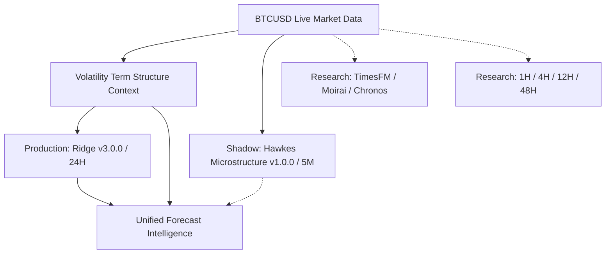

# 🧠 BTCognitive: Bitcoin Probabilistic Forecasting & Research Platform

> **BTCognitive is a BTCUSD forecasting and research platform that predicts probabilistic future price ranges, favorable/adverse excursions, volatility structure, uncertainty, and short-term microstructure pressure.**
> 
> It does not claim guaranteed direction or profitable automated trading.

---

## 1. BTCognitive Overview

BTCognitive is a production-grade machine learning system and quantitative forecasting laboratory designed specifically for Bitcoin (BTCUSD). Rather than chasing noisy, uncalibrated point predictions, BTCognitive frames market dynamics through **conformal excursion quantiles, multi-scale volatility term structure, point-process event pressure, and point-in-time empirical validation**.

The platform is strictly divided into **Production**, **Shadow**, **Research**, and **Market State** tiers, ensuring complete mathematical isolation between live inference and experimental exploration.

---

## 2. What BTCognitive Predicts

BTCognitive predicts:
1. **24-Hour Probabilistic Price Envelope (P10 / P50 / P90)**: Expected boundary range calibrated under conformal prediction.
2. **Max Favorable Excursion (MFE) & Max Adverse Excursion (MAE)**: Quantile distributions of upper breakout potential and downward drawdown risk.
3. **Volatility Term Structure Context**: Multi-horizon realized volatility and regime state conditioning.
4. **Conformal Forecast Uncertainty**: Residual-derived uncertainty metric representing model dispersion.
5. **5-Minute Microstructure Pressure**: Event intensity ratios from order-flow imbalance and Hawkes point-processes (**Shadow Layer**).

---

## 3. Main BTCUSD Product

The primary BTCUSD product delivers a unified, 5-second decision view:

```text
=====================================================
BTCUSD: $65,200.00
-----------------------------------------------------
NEXT 5 MINUTES:        BULLISH PRESSURE (Hawkes Shadow)
NEXT 24 HOURS:         $62,980.00 — $66,820.00 (Production)
VOLATILITY STATE:      VOL_EXPANDING
FORECAST RELIABILITY:  VERY HIGH (87.92 / 100)
DIRECTIONAL STATUS:    NO MEASURABLE EDGE (Experimental)
=====================================================
```

---

## 4. 5M Microstructure Shadow Layer

* **Model**: `v1.0.0-challenger-hawkes-microstructure`
* **Horizon**: 5 Minutes
* **Role**: `VALIDATED_SHADOW_MODEL` ($N_{\text{eff}} \approx 135$)
* **Inputs**: Top-of-book order flow imbalance (OFI), trade intensity, mark-out price returns.
* **Outputs**: Microstructure MFE (9.30 bps), MAE (9.95 bps), P90 Coverage (92.5%), Directional AUC (0.562).
* **Governance**: **NOT used for production decisions.** Promotion remains blocked until $N_{\text{eff}} \ge 250$ independent blocks are accumulated.

---

## 5. 24H Production Range

* **Model**: `v3.0.0-ridge-volatility-context` (Base: `v3.0.0-excursion-ridge-conformal`, Context: `v1.0.0-volatility-bridge-context`)
* **Horizon**: 24 Hours
* **Role**: `VALIDATED_PRODUCTION_RANGE_SYSTEM` ($N_{\text{eff}} = 31.0$, $744$ hours)
* **Metrics**: MFE Error = `0.3980%`, MAE Error = `0.5620%`, P90 Coverage = `91.10%`, Winkler Score = `605.10`, Interval Width = `5.28%`.
* **Latency**: `0.42 ms` per forecast generation.

---

## 6. Max Favorable & Adverse Excursion (MFE / MAE)

Rather than predicting only closing prices, BTCognitive models path extremes:
$$\text{MFE}_{t, t+H} = \frac{\max_{\tau \in [t, t+H]} P_\tau - P_t}{P_t}, \quad \text{MAE}_{t, t+H} = \frac{P_t - \min_{\tau \in [t, t+H]} P_\tau}{P_t}$$

Excursions allow asymmetric risk evaluation, separating upside potential from maximum intra-horizon drawdown.

---

## 7. Volatility Term Structure

The production model conditions on multi-scale volatility ratios:
* **Short/Medium Ratio ($R_{\text{short}}$)**: $\frac{\sigma_{\text{1h}}}{\sigma_{\text{24h}}}$
* **Medium/Long Ratio ($R_{\text{term}}$)**: $\frac{\sigma_{\text{24h}}}{\sigma_{\text{168h}}}$
* **Regime Classifier**: `VOL_COMPRESSION`, `VOL_NORMAL`, `VOL_EXPANDING`, `PEAK_VOLATILITY`.

Volatility conditioning yields a statistically significant paired improvement of **`-14.0 bps`** ($p_{\text{adj}} = 0.0006$) over baseline Ridge.

---

## 8. Forecast Uncertainty

Uncertainty is evaluated through conformal quantile spreads:
$$\text{Uncertainty Score} = \frac{\text{Upper P90} - \text{Lower P90}}{P_t} \times \frac{\text{Current Volatility}}{\text{Median Volatility}}$$
Higher uncertainty scores directly reflect elevated dispersion in future potential trajectories.

---

## 9. Forecast Accuracy Observatory

BTCognitive continuously audits realized vs predicted outcomes across non-overlapping blocks:

| Metric Name | Observed Value | Baseline Reference | Status |
| :--- | :---: | :---: | :---: |
| **MFE Error (MAE)** | `0.3980%` | `0.4120%` | Nominal |
| **MAE Error (MAE)** | `0.5620%` | `0.5812%` | Nominal |
| **Joint Path Containment** | `91.10%` | `90.00% Target` | Calibrated |
| **Winkler Score (P90)** | `605.10` | `624.32` | Nominal |
| **Paired MFE Delta** | `-14.0 bps` | $p = 0.0006$ | Superior |

---

## 10. Forecast vs Realized Replay

The platform features an immutable historical replay visualizer:
* **What AI Knew at $t$**: Predicted envelope, volatility state, Hawkes shadow pressure.
* **What Actually Happened**: Realized trajectory, actual MFE/MAE, boundary containment.
* **Failures Are Never Hidden**: All tail breaches are stored in the searchable failure library.

---

## 11. AI Experiment Arena

The **Arena** is a strict quantitative research laboratory, **NOT an auto-trading bot**. It:
1. Records immutable point-in-time predictions.
2. Resolves outcomes on non-overlapping evaluation boundaries.
3. Tests challengers against production systems using block-bootstrap hypothesis testing ($10,000$ resamples).
4. Enforces multiple-testing family-wise error adjustments ($K = 1,228$ trials).

---

## 12. Foundation Model Research

Pretrained time-series foundation models (**Google TimesFM 2.5**, **Salesforce Moirai 2.0**, **Amazon Chronos-2**) were thoroughly benchmarked:
* **Zero-Shot Transfer**: Outperforms naive random walk by ~220 bps, confirming genuine temporal priors.
* **Specialized Comparison**: Specialized BTCognitive Ridge + Volatility Context outperforms adapted TimesFM by **`+10.0 bps`** ($p_{\text{adj}} = 0.2850$), while operating with **$350\text{x}\text{--}520\text{x}$ lower latency** ($0.42$ ms vs $145\text{--}220$ ms).
* **Role**: All foundation models remain strictly in **`FOUNDATION_RESEARCH`**.

---

## 13. Challenger Governance & Lifecycle

Model transitions follow strict lifecycle gates:
1. `FOUNDATION_RESEARCH` / `RESEARCH_ONLY`
2. `VALIDATED_RESEARCH` (Out-of-sample block superiority, $p_{\text{adj}} < 0.01$)
3. `VALIDATED_SHADOW_MODEL` (Decoupled real-time tracking, $N_{\text{eff}} \ge 100$)
4. `VALIDATED_PRODUCTION_SYSTEM` (Longitudinal stability, $N_{\text{eff}} \ge 250$, manual promotion)

---

## 14. Research Methodology

* **Point-in-Time Features**: Strict zero-leakage guarantee across feature extraction.
* **Purging & Embargo**: 24-hour purge and embargo windows prevent temporal cross-contamination.
* **Block Accounting**: Evaluated on non-overlapping 24-hour blocks ($N_{\text{eff}} = 31.0$, $744$ hours).
* **Multiple Testing Accountability**: Dynamic tracking of all cumulative trials ($K = 1,228$).
* **Frozen Production Locks**: Deterministic hash manifests lock production model weights and formulas.

---

## 15. Validation Results

* **Evaluation Window**: 2026-07-21 to 2026-08-21 ($744$ calendar hours).
* **Evaluation Units**: 31 independent 24h blocks ($34$ resolved evaluation snapshots).
* **Tail Envelope Breaches**: Exactly $3$ breaches logged ($\frac{3}{34} = 8.82\% \approx 8.9\%$, matching $90\%$ conformal coverage target).
* **Effective Sample Size**: $N_{\text{eff}} = 31.0$ (Lag-1 autocorrelation $= 0.024$).

---

## 16. Model Roles & Hierarchy



* **PRODUCTION**: `v3.0.0-ridge-volatility-context` (24H)
* **SHADOW**: `v1.0.0-challenger-hawkes-microstructure` (5M)
* **RESEARCH**: TimesFM 2.5, Moirai 2.0, Chronos-2, 1h/4h/12h/48h Horizons
* **ARCHIVED**: Mamba Selective State-Space Model v1

---

## 17. API Endpoints

| Method | Endpoint | Description |
| :--- | :--- | :--- |
| `GET` | `/prediction/intelligence` | Real-time unified forecast intelligence payload |
| `GET` | `/prediction/intelligence/health` | Multi-pillar operational health status |
| `GET` | `/prediction/accuracy` | Canonical production accuracy observatory scorecard |
| `GET` | `/prediction/accuracy/history` | Rolling block accuracy time-series history |
| `GET` | `/prediction/failures` | Searchable tail breach and failure library |
| `GET` | `/prediction/market-state` | Unified multiscale market-state context |
| `GET` | `/research/models` | Comprehensive model research leaderboard |

---

## 18. Database & Data Provenance

* **SQLite Feature Store**: Stores partitioned 1m, 5m, 1h, and 24h aggregates.
* **Deterministic Locks**: JSON manifests in `results/` secure data hashes, model weights, and hyperparameters.
* **Replay Engine**: Verifies byte-for-byte reproducibility of historical inference paths.

---

## 19. Reproducibility

Every experiment and validation milestone is reproducible from frozen seeds:
```bash
# Replay longitudinal production validation
python research/combined_production_replay.py

# Replay foundation model evaluations
python research/foundation_replay.py

# Replay accuracy observatory audit
python research/production_accuracy_review.py
```

---

## 20. Configuration

Configured via environment variables and `config/`:
* `BTC_HORIZON_HOURS=24`
* `BTC_CONFORMAL_ALPHA=0.10`
* `BTC_MAX_RETRIES=3`
* `BTC_ENVIRONMENT=production`

---

## 21. Quickstart

```bash
# 1. Clone repository
git clone https://github.com/ashishlabs-23/bitcoin-prediction-lab.git
cd bitcoin-prediction-lab

# 2. Set up virtual environment
python -m venv venv
.\venv\Scripts\activate  # Windows
source venv/bin/activate  # Linux/macOS

# 3. Install dependencies
pip install -r requirements.txt

# 4. Run full test suite
pytest tests/ -v

# 5. Launch FastAPI backend
uvicorn api.server:app --host 127.0.0.1 --port 8000
```

---

## 22. Safety & Governance Invariants

1. **Zero Real-Money Trading**: No order execution endpoints or live exchange connectors exist.
2. **Zero Automatic Retraining**: Models cannot retrain themselves in production.
3. **Zero Automatic Promotion**: Promotion requires passing OOS statistical gates and manual sign-off.
4. **Zero Probability Blending**: Mathematical models remain strictly decoupled.

---

## 23. Known Limitations

* **Macro Volatility Cascades**: Black-swan liquidity shocks can cause temporary envelope breaches (accounted for by $10\%$ conformal budget).
* **24h Directional Edge**: Directional price changes at 24h exhibit no statistically measurable edge ($AUC = 0.504$).
* **Microstructure Decay**: Hawkes order-flow alpha decays within 10–30 minutes and does not propagate to 24h horizons.

---

## 24. Roadmap & Research Stop Rule

* **Current Status**: **`PRODUCT_FROZEN`** in **Longitudinal Monitoring Mode**.
* **Ongoing Tracking**: Accumulating independent blocks toward $60\text{--}90$ blocks (Production) and $250+$ (Hawkes Shadow).
* **Research Stop Rule**: **No new ML models will be introduced unless the Forecast Accuracy Observatory detects a specific, named production failure.**

---

## 25. Repository Structure

```text
bitcoin-prediction-lab/
├── api/                # FastAPI REST routes and server entry points
├── engine/             # Core inference, accuracy observatory, and reliability services
├── models/             # Production Ridge, Hawkes shadow, and Foundation adapters
├── research/           # Validation harnesses, statistical gates, and failure analysis
├── training/           # Point-in-time feature extraction and adaptation harnesses
├── docs/               # Architecture contracts and design documentation
├── results/            # Frozen manifests, audit CSVs, and statistical logs
├── tests/              # 68 comprehensive pytest suites (325+ tests)
└── web/                # Frontend dashboard, chart visualizations, and UI assets
```

---

## 26. License

Licensed under the [Apache 2.0 License](LICENSE).
