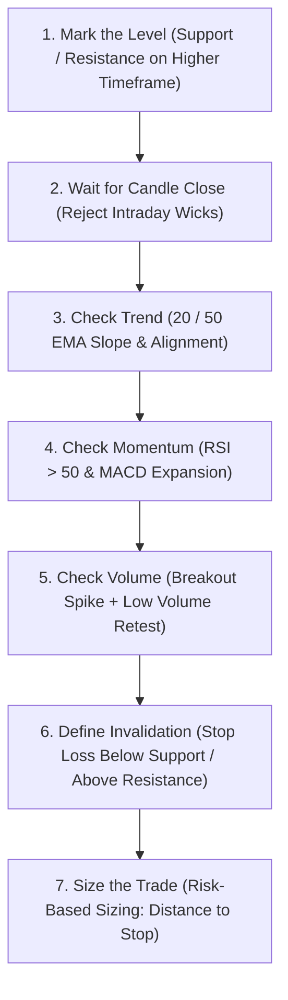

# Technical Analysis Cheat Sheet & Breakout Confirmation Engine

Use indicators to **confirm** a price breakout—not to predict it with certainty. The strongest setup usually has three parts: price breaks a meaningful level, momentum agrees, and volume expands.

---

## 1. Indicator Signals

| Indicator | Bullish Breakout Clues | Bearish Breakout Clues | Important Caution |
|---|---|---|---|
| **RSI (14)** | RSI holds above 50; stronger confirmation above 55–60; bullish divergence near support | RSI falls below 50; stronger confirmation below 45–40; bearish divergence near resistance | Above 70 is not automatically a short; below 30 is not automatically a long |
| **MACD (12, 26, 9)** | MACD line crosses above signal line; histogram turns positive and expands; MACD moves above zero | MACD line crosses below signal line; histogram turns negative and expands; MACD moves below zero | Crossovers can be late or produce false signals in sideways markets |
| **Moving Averages** | Price above a rising 20/50 EMA; 20 EMA above 50 EMA; pullback holds the moving average | Price below a falling 20/50 EMA; 20 EMA below 50 EMA; rally fails at the moving average | Moving averages lag price and work poorly in a choppy range |
| **Volume** | Breakout candle closes above resistance with volume greater than its recent average; follow-through remains strong | Breakdown candle closes below support with expanding volume; subsequent bounce has weak volume | A large wick and weak volume may indicate a false breakout |

> [!NOTE]
> A MACD line crossing above its signal line is generally interpreted as bullish, while traditional RSI reference zones commonly use 70 and 30 for overbought and oversold conditions. RSI is best treated as a momentum and strength tool, not as an automatic reversal signal.

---

## 2. Bullish Breakout Checklist

Look for most of these conditions:

- [ ] **Confirmed Close**: Price closes clearly above established resistance, not merely wicks above it.
- [ ] **Volume Expansion**: The breakout candle has above-average volume (vs. 20-period SMA of volume).
- [ ] **Momentum Agreement**: RSI is above 50 and preferably rising toward 55–70.
- [ ] **MACD Expansion**: MACD is above its signal line; the histogram is positive and expanding.
- [ ] **Trend Alignment**: Price is above a rising 20 or 50 EMA; 20 EMA > 50 EMA.
- [ ] **Support Retest**: A retest of the old resistance level holds as support.
- [ ] **Volume Dynamics on Retest**: The retest occurs on lower volume, followed by renewed buying volume.

### Example Walkthrough:
Resistance is at $100,000. Price closes at $102,000 with strong volume, RSI rises from 52 to 62, and MACD’s positive histogram expands. On the next session, price retests $100,000–$101,000 and buyers defend that area. This is a stronger bullish setup than simply seeing one candle wick through $100,000.

---

## 3. Bearish Breakout Checklist

Look for most of these conditions:

- [ ] **Confirmed Breakdown**: Price closes clearly below established support.
- [ ] **Volume Expansion**: Breakdown volume is above its recent average.
- [ ] **Momentum Collapse**: RSI falls below 50 and preferably continues toward 40.
- [ ] **MACD Deterioration**: MACD is below its signal line; the histogram is negative and expanding.
- [ ] **Trend Alignment**: Price is below a falling 20 or 50 EMA; 20 EMA < 50 EMA.
- [ ] **Failed Retest**: A retest of old support fails and acts as resistance.
- [ ] **Volume Dynamics on Retest**: The failed retest occurs on weak volume, followed by renewed selling volume.

### Example Walkthrough:
Support is at $100,000. Price closes at $97,000 on strong volume, RSI falls to 42, and MACD remains below its signal line. Price then returns to $99,000–$100,000 but gets rejected. That failed retest provides stronger short confirmation than the initial breakdown alone.

---

## 4. Volume Patterns

| Volume Pattern | Likely Interpretation |
|---|---|
| **Rising price + rising volume** | Buyers are actively participating; bullish move has high confirmation |
| **Falling price + rising volume** | Sellers are actively participating; bearish move has high confirmation |
| **Rising price + falling volume** | Rally is losing participation; high alert for false breakout |
| **Falling price + falling volume** | Selling pressure is weakening, but this is not automatically bullish |
| **Breakout with volume spike** | Credible breakout vs. baseline volume |
| **Pullback with declining volume** | Healthy continuation structure, especially if breakout level holds |
| **Breakout with long upper wick** | Sellers rejected higher prices; breakout is suspect (bull trap) |
| **Breakdown with long lower wick** | Buyers rejected lower prices; breakdown is suspect (bear trap) |

> [!TIP]
> Avoid relying on a rigid rule such as “volume must be exactly 50% above average”—the key is relative comparison against recent moving averages and the conviction of the candle close.

---

## 5. Practical 7-Step Workflow

1. **Mark the level**: Identify support or resistance on a higher timeframe (e.g. 4H, 1D).
2. **Wait for a close**: Do not treat an intraday wick as a confirmed breakout.
3. **Check trend**: Use the 20/50 EMA relationship and slope.
4. **Check momentum**:
   - Bullish: RSI > 50 and MACD improving.
   - Bearish: RSI < 50 and MACD weakening.
5. **Check volume**: Require participation on the breakout and weaker volume on the retest.
6. **Define invalidation**:
   - Long: Stop below the breakout level or recent higher low.
   - Short: Stop above the failed support or recent lower high.
7. **Size the trade**: Calculate position size from the distance to your stop, not subjective setup confidence.

---

## 6. Fast Decision Matrix

| Price Action | Momentum | Volume | Bias / Action |
|---|---|---|---|
| **Above resistance** | RSI > 50, MACD bullish | Expanding | **Bullish continuation candidate** |
| **Above resistance** | Indicators weak | Low or declining | **Possible false breakout; wait** |
| **Below support** | RSI < 50, MACD bearish | Expanding | **Bearish continuation candidate** |
| **Below support** | Indicators improving | Low or declining | **Possible bear trap; wait** |
| **Inside a range** | Mixed | Average or low | **No clear edge; avoid forcing trades** |

---

## 7. Core Rules & Risk Management

- **Core Rule**: Enter long only when price breaks resistance and confirmation metrics support buyers. Enter short only when price breaks support and confirmation metrics support sellers.
- **Conflict Rule**: When price action and indicator signals conflict, the highest expected value action is to **wait**.
- **Risk Notice**: Technical analysis improves structure and discipline, but cannot eliminate market risk. Never trade without a predefined invalidation level and calibrated position sizing.
