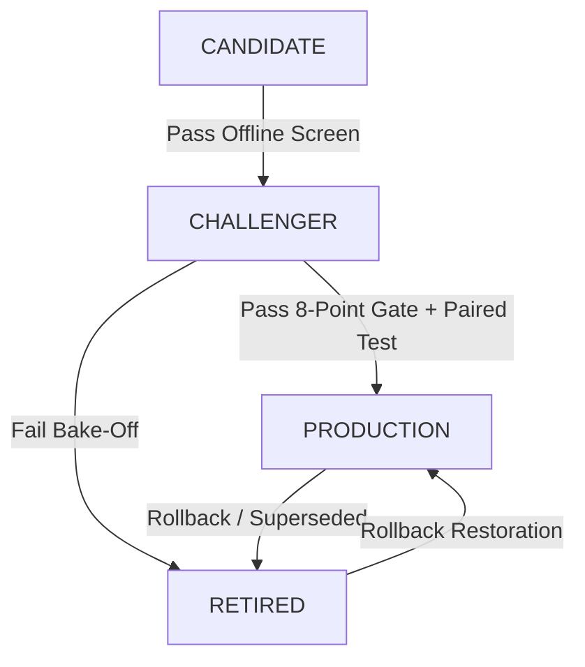

# 🔄 Model Lifecycle & Registry Architecture

## 1. The Four Lifecycle States

1. **`CANDIDATE`**: Offline experimental architecture undergoing preliminary research and walk-forward verification.
2. **`CHALLENGER`**: Validated offline model authorized for 1v1 walk-forward bake-offs and live shadow mode logging.
3. **`PRODUCTION`**: Active, single-instance forecasting engine driving all public API responses.
4. **`RETIRED`**: Demoted or superseded model archived for historical lineage and instant rollback capability.

---

## 2. State Transition Governance

---

## 3. Rollback Safety Protocol

When a promoted production model experiences degradation:
1. `challenger_registry.rollback()` instantly restores the previous production model.
2. Zero database records, provenance hashes, or past prediction rows are deleted or overwritten.
3. The failed version transitions to `RETIRED` with full diagnostic audit logs.
