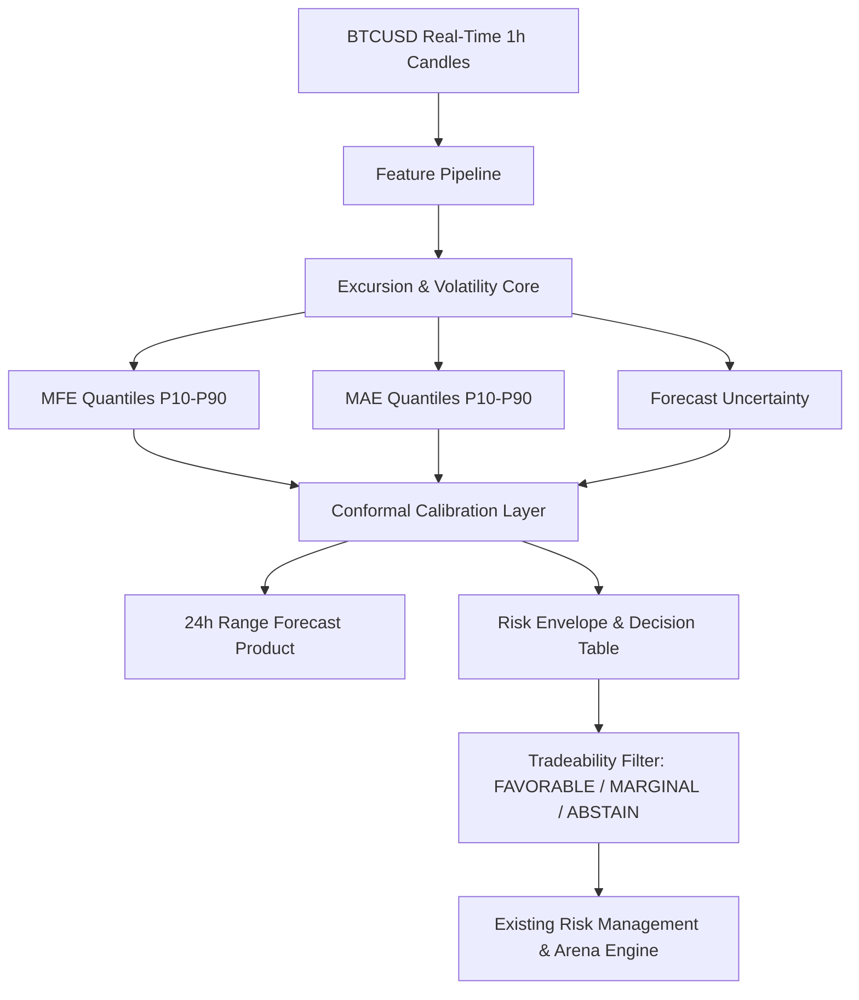

# 🏛️ BTCognitive: Range, Excursion & Risk Prediction Architecture Specification

## 1. System Vision & Paradigm Shift
BTCognitive transitions from a noisy binary BUY/SELL classifier into a **Probabilistic Range, Excursion & Volatility Risk Prediction Engine**.

## 2. Core Mathematical Specifications
1. **Favorable Excursion (MFE)**: Continuous expectation and non-crossing quantiles $P_{10}, P_{25}, P_{50}, P_{75}, P_{90}$ with pinball loss optimization.
2. **Price Range Bands**:
   - $	ext{Upper Range}_{90} = 	ext{Price}_t 	imes (1 + 	ext{MFE}_{90})$
   - $	ext{Lower Range}_{90} = 	ext{Price}_t 	imes (1 - 	ext{MAE}_{90})$
3. **Tradeability Scoring**:
   $$	ext{Utility Score} = \mathbb{E}[	ext{MFE}] - 1.5 	imes \mathbb{E}[	ext{MAE}] - 	ext{Transaction Cost}$$
4. **Position Sizing Engine**: Risk exposure scaled inversely to forecast uncertainty and directly to tradeability score.

## 3. Implementation Guardrails
- No live production endpoints are altered during research.
- Production TFT and checkpoints remain locked until full integration gate approval.
