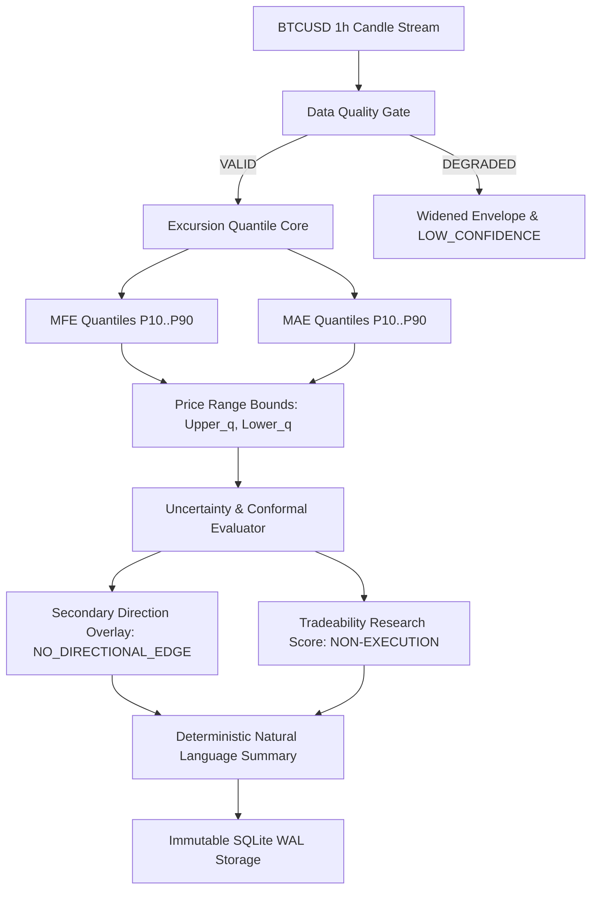

# 📐 BTCognitive: Production Range, Excursion & Risk Product Specification

## 1. Executive Summary & Paradigm Shift
BTCognitive has transitioned from a noisy binary BUY/SELL classifier into a **Probabilistic BTCUSD Range, Excursion, Volatility & Risk Intelligence System**.

### Primary Prediction Outputs
* **BTCUSD Future Range**: Core 50% Median Range, 80% Range, and 90% Empirical Forecast Envelope.
* **Expected Excursions**: Favorable Excursion (MFE) and Adverse Excursion (MAE) Quantiles ($P_{10}, P_{25}, P_{50}, P_{75}, P_{90}$).
* **Forecast Uncertainty**: Conformal prediction interval width and relative dispersion ratio.
* **Secondary Direction Overlay**: Defaults to `NO_DIRECTIONAL_EDGE` when directional signal is noise-dominated.
* **Tradeability Research Score**: Non-execution informational score (`HIGH`, `MEDIUM`, `LOW`).

---

## 2. Mathematical Definition & Dataflow

### Price Range Boundaries
$$\text{Upper Range}_q = \text{Price}_t \times (1 + \text{MFE}_q)$$
$$\text{Lower Range}_q = \text{Price}_t \times (1 - \text{MAE}_q)$$

---

## 3. Product Governance Guardrails
1. **No Real Trading**: The system contains zero execution keys, zero live broker connections, and zero live order routing.
2. **Immutable Predictions**: Predictions are written to SQLite in WAL mode with immutable timestamps.
3. **Traceability**: Every forecast explicitly records `model_version`, `horizon`, `uncertainty`, and `data_quality`.
